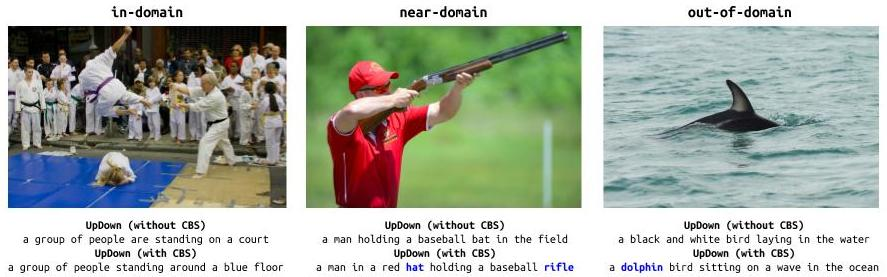

UpDown Captioner Baseline for `nocaps`
=====================================

Baseline model for [`nocaps`][1] benchmark, a re-implementation based on the
[UpDown image captioning model trained on the COCO dataset (only)](https://github.com/peteanderson80/up-down-captioner).

Checkout our package documentation at [nocaps.org/updown-baseline](https://nocaps.org/updown-baseline)!



If you find this code useful, please consider citing:

```text
@article{nocaps,
  author  = {Harsh Agrawal* and Karan Desai* and Yufei Wang and Xinlei Chen and Rishabh Jain and
             Mark Johnson and Dhruv Batra and Devi Parikh and Stefan Lee and Peter Anderson},
  title   = {{nocaps}: {n}ovel {o}bject {c}aptioning {a}t {s}cale},
  journal = {arXiv preprint arXiv:1812.08658},
  year    = {2018},
}
```

As well as the paper that proposed this model: 

```text
@inproceedings{Anderson2017up-down,
  author    = {Peter Anderson and Xiaodong He and Chris Buehler and Damien Teney and Mark Johnson
               and Stephen Gould and Lei Zhang},
  title     = {Bottom-Up and Top-Down Attention for Image Captioning and Visual Question Answering},
  booktitle = {CVPR},
  year      = {2018}
}
```

How to setup this codebase?
---------------------------

This codebase requires Python 3.6+ or higher. It uses PyTorch v1.1, and has out of the box support
with CUDA 9 and CuDNN 7. The recommended way to set this codebase up is through Anaconda or
Miniconda. However, it should work just as fine with VirtualEnv.

### Install Dependencies

1. Install Anaconda or Miniconda distribution based on Python3+ from their [downloads' site][6].

2. Clone the repository.

```sh
git clone https://www.github.com/nocaps-org/updown-baseline
cd updown-baseline
```

3. Create a conda environment and install all the dependencies, and this codebase as a package in development version. 

```sh
conda create -n updown python=3.6
conda activate updown
pip install -r requirements.txt
python setup.py develop
```

**Note:** If `evalai` package install fails, install these packages and try again:

```sh
sudo apt-get install libxml2-dev libxslt1-dev
```

Now you can `import updown` from anywhere in your filesystem as long as you have this conda environment activated.


#### Download Image Features

We provide pre-extracted bottom-up features for COCO and `nocaps` splits. These are extracted
using a Faster-RCNN detector pretrained on Visual Genome ([Anderson et al. 2017][7]). We extract
features from 100 region proposals for an image, and select them based on a confidence threshold
of 0.2 - we finally get 10-100 features per image (adaptive). 

Download (or symlink) the image features under `$PROJECT_ROOT/data` directory:

[`coco_train2017`](https://bit.ly/2G2iCuW), [`coco_val2017`](https://bit.ly/328hiAe),
[`nocaps_val`](https://bit.ly/32iRnpx), [`nocaps_test`](https://bit.ly/2XvL4jQ).


#### Download Annotations

Download COCO captions and `nocaps` val/test image info and arrange in a directory structure as follows:

```
$PROJECT_ROOT/data
    |-- coco
    |   +-- annotations
    |       |-- captions_train2017.json
    |       +-- captions_val2017.json
    +-- nocaps
        +-- annotations
            |-- nocaps_val_image_info.json
            +-- nocaps_test_image_info.json
```

1. COCO captions: http://images.cocodataset.org/annotations/annotations_trainval2017.zip  
2. nocaps val image info: https://s3.amazonaws.com/nocaps/nocaps_val_image_info.json  
3. nocaps test image info: https://s3.amazonaws.com/nocaps/nocaps_test_image_info.json  


### Vocabulary

Build caption vocabulary using COCO train2017 captions.

```
python scripts/build_vocabulary.py -c data/coco/captions_train2017.json -o data/vocabulary
```

### Evaluation Server

`nocaps` val and test splits are held privately behind EvalAI. To evaluate on `nocaps`, create an account on [EvalAI][4] and get the auth token from [profile details][5]. Set the token through EvalAI CLI as follows:

```
evalai set_token <your_token_here>
```

You are all set to use this codebase!


Training
--------

We manage experiments through config files -- a config file should contain arguments which are specific to a particular experiment, such as those defining model architecture, or optimization hyperparameters. Other arguments such as GPU ids, or number of CPU workers should be declared in the script and passed in as argparse-style arguments. Train a baseline UpDown Captioner with all the default hyperparameters as follows. This would reproduce results of the first row in `nocaps` val/test tables from our paper.

```
python scripts/train.py \
    --config-yml configs/updown_nocaps_val.yaml \
    --gpu-ids 0 --serialization-dir checkpoints/updown-baseline
```

Refer [`updown/config.py`][2] for default hyperparameters. For other configurations, pass a path to config file through `--config-yml` argument, and/or a set of key-value pairs through `--config-override` argument. For example:

```
python scripts/train.py \
    --config-yml configs/updown_nocaps_val.yaml \
    --config-override OPTIM.BATCH_SIZE 250 \
    --gpu-ids 0 --serialization-dir checkpoints/updown-baseline
```

#### Multi-GPU Training

Multi-GPU training is fully supported, pass GPU IDs as `--gpu-ids 0 1 2 3`.

#### Saving Model Checkpoints

This script serializes model checkpoints every few iterations, and keeps track of best performing checkpoint based on overall CIDEr score. Refer [updown/utils/checkpointing.py][3] for more details on how checkpointing is managed. A copy of configuration file used for a particular experiment is also saved under `--serialization-dir`.

#### Logging

This script logs loss curves and metrics to Tensorboard, log files are at `--serialization-dir`. Execute `tensorboard --logdir /path/to/serialization_dir --port 8008` and visit `localhost:8008` in the browser.


Evaluation and Inference
------------------------

Generate predictions for `nocaps` val or `nocaps` test using a pretrained checkpoint:

```
python scripts/inference.py \
    --config-yml /path/to/config.yaml \
    --checkpoint-path /path/to/checkpoint.pth \
    --output-path /path/to/save/predictions.json \
    --gpu-ids 0
```

Add `--evalai-submit` flag if you wish to submit the predictions directly to EvalAI and get results.


Results
-------

Pre-trained checkpoint with the provided config is available to download here:

1. Checkpoint (`.pth` file): https://bit.ly/2JwuHcP
2. Predictions on `nocaps val`: https://bit.ly/2YKxxBA
3. Predictions on `nocaps test`: https://bit.ly/2XBs0R4

<table>
  <tr>
    <th></th>
    <th colspan="2">in-domain</th>
    <th colspan="2">near-domain</th>
    <th colspan="2">out-of-domain</th>
    <th colspan="6">overall</th>
  </tr>
  <tr>
    <th>split</th>
    <th>CIDEr</th>
    <th>SPICE</th>
    <th>CIDEr</th>
    <th>SPICE</th>
    <th>CIDEr</th>
    <th>SPICE</th>
    <th>BLEU1</th>
    <th>BLEU4</th>
    <th>METEOR</th>
    <th>ROUGE</th>
    <th>CIDEr</th>
    <th>SPICE</th>
  </tr>
  <tr>
    <th>val</th>
    <td>78.1</td>
    <td>11.6</td>
    <td>57.7</td>
    <td>10.3</td>
    <td>31.3</td>
    <td>8.3</td>
    <td>73.7</td>
    <td>18.3</td>
    <td>22.7</td>
    <td>50.4</td>
    <td>55.3</td>
    <td>10.1</td>
  </tr>
  <tr>
    <th>test</th>
    <td>74.3</td>
    <td>11.5</td>
    <td>56.9</td>
    <td>10.3</td>
    <td>30.1</td>
    <td>8.1</td>
    <td>74.0</td>
    <td>19.2</td>
    <td>23.0</td>
    <td>51.0</td>
    <td>54.3</td>
    <td>10.1</td>
  </tr>
</table>

[1]: https://nocaps.org
[2]: https://github.com/nocaps-org/updown-baseline/blob/master/updown/config.py
[3]: https://github.com/nocaps-org/updown-baseline/blob/master/updown/utils/checkpointing.py
[4]: http://evalai.cloudcv.org
[5]: http://evalai.cloudcv.org/web/profile
[6]: https://conda.io/docs/user-guide/install/download.html
[7]: https://arxiv.org/abs/1707.07998
